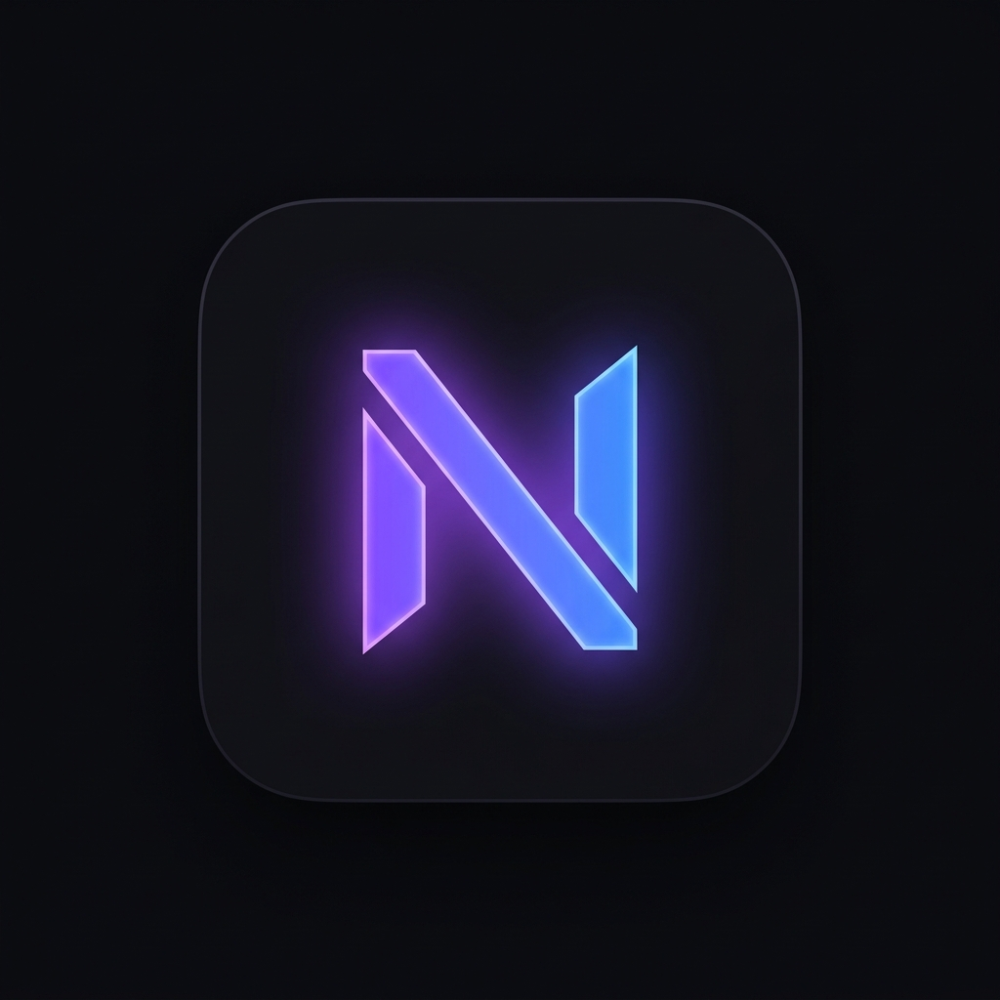

<div align="center">
  
  <h1>Nexo</h1>
  <p><em>Tus finanzas, bajo control. Tu vida, en equilibrio.</em></p>
</div>

---

## 🌌 El significado de "Nexo"

En la vida, el dinero no es un fin en sí mismo; es un **nexo** (un enlace o conexión) entre tu presente y tus metas futuras. 

Cada gasto que haces, cada pequeña meta de ahorro que cumples y cada decisión financiera que tomas está intrínsecamente conectada con tu tranquilidad, tu tiempo y tus sueños. **Nexo** nace para darte claridad sobre esa conexión. No es solo un registro de números y categorías; es el puente que une tu esfuerzo diario con la vida que quieres construir. 

Al comprender el *nexo* entre lo que gastas hoy y lo que deseas mañana, retomas el control total de tu bienestar financiero.

---

## ✨ Características Principales

- 📊 **Gestor de Transacciones:** Registra tus ingresos y gastos de forma rápida y categorizada.
- 🎯 **Objetivos de Ahorro:** Define metas (viajes, emergencias, compras) y visualiza tu progreso con barras animadas.
- 🎮 **Gamificación (Gamified Finance):** Sube de nivel y gana puntos de experiencia (XP) por mantener rachas positivas y cuidar tus finanzas.
- 📱 **Progressive Web App (PWA):** Instálala nativamente en tu iPhone o Android y úsala como una app real.
- 🔒 **Seguridad y Privacidad:** Autenticación robusta y segura respaldada por Clerk. Cada usuario tiene su propia bóveda financiera privada.
- 🎨 **Diseño Premium:** UI/UX moderna, oscura, con gradientes sutiles y micro-animaciones usando Framer Motion y Tailwind CSS.

## 🛠️ Stack Tecnológico

- **Framework:** Next.js 15 (App Router)
- **Lenguaje:** TypeScript
- **Base de Datos:** PostgreSQL + Prisma ORM
- **Estilos:** Tailwind CSS v4 + Variables CSS Nativas
- **Animaciones:** Framer Motion + Canvas Confetti
- **Gráficos:** Recharts
- **Autenticación:** Clerk
- **Despliegue:** Vercel

## 🚀 Instalación y Desarrollo Local

1. **Clonar el repositorio**
   ```bash
   git clone https://github.com/Buhokan/Nexo.git
   cd nexo
   ```

2. **Instalar dependencias**
   ```bash
   npm install
   ```

3. **Configurar variables de entorno**
   Crea un archivo `.env` en la raíz del proyecto y añade tus credenciales:
   ```env
   NEXT_PUBLIC_CLERK_PUBLISHABLE_KEY=tu_clave_publica
   CLERK_SECRET_KEY=tu_clave_secreta
   DATABASE_URL=tu_url_de_postgres
   NEXT_PUBLIC_APP_URL=http://localhost:3000
   ```

4. **Sincronizar la base de datos**
   ```bash
   npx prisma db push
   ```

5. **Iniciar el servidor de desarrollo**
   ```bash
   npm run dev
   ```
   Abre [http://localhost:3000](http://localhost:3000) en tu navegador.

---
<div align="center">
  <i>Construido para hacer que las finanzas personales sean claras, hermosas y gratificantes.</i>
</div>
